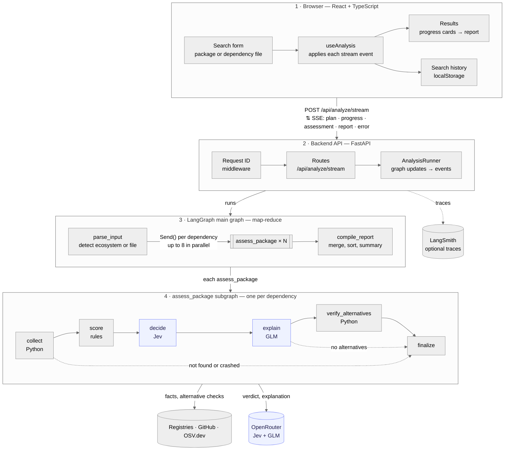

# Package Health Advisor

**"Should I use this library?"** Give it a package name, or paste a dependency file. For each
dependency it checks adoption and release history, GitHub activity (last commit, open issues,
stars) and known vulnerabilities. It then returns a verdict with reasons and suggests
alternatives.

It supports eight ecosystems:

| Ecosystem | Dependency files | Metadata & releases | Adoption signal |
| --- | --- | --- | --- |
| **npm** (JS/TS, incl. pnpm) | `package.json`, `package-lock.json`, `pnpm-lock.yaml` | npm registry | weekly downloads |
| **PyPI** (Python) | `requirements*.txt`, `pyproject.toml`, `Pipfile` | PyPI JSON API | weekly downloads (pypistats; dependents if rate limited) |
| **Maven Central** (Java/Kotlin) | `pom.xml`, `build.gradle(.kts)` | deps.dev | dependent packages |
| **NuGet** (C#/.NET) | `*.csproj`, `Directory.Packages.props` | deps.dev | all-time downloads |
| **Go modules** | `go.mod` | deps.dev | none published (GitHub carries it) |
| **crates.io** (Rust) | `Cargo.toml` | crates.io API | weekly average of 90-day downloads |
| **RubyGems** (Ruby) | `Gemfile` | deps.dev | all-time downloads |
| **Packagist** (PHP) | `composer.json` | Packagist API | weekly average of monthly downloads |

GitHub, OSV.dev, the scoring rules, Jev and the LLM are shared by every ecosystem.

- **Backend:** Python, FastAPI, and a LangGraph agent. Verdicts come from Jev (`typesafe/jev-1.13`), TypeSafe's
  decision model, and the reasons, alternatives and summary are written by `z-ai/glm-5.3-flash`. Both run via OpenRouter.
- **Frontend:** React, TypeScript, Vite, Tailwind CSS and shadcn/ui.

## How the agent works

The main graph is a map-reduce built on LangGraph's **Send API**. Each dependency runs through a
per-package **subgraph**:



1. **`parse_input`** reads either one package spec (`requests>=2.31`, `org.slf4j:slf4j-api:2.0.9`)
   or a dependency file. With `"ecosystem": "auto"` (the default) a single package's registry is
   detected first (see below). The file's format is detected from its content. Names are normalized and
   validated by the ecosystem's adapter. Non-registry specs (git, path, workspace) are skipped.
2. **Fan-out (map):** one `Send("assess_package", …)` per dependency. The subgraphs run in
   parallel, and `max_concurrency` limits how many run at once. Inside each subgraph:
   - **`collect`:** the ecosystem adapter fetches registry metadata and adoption, then GitHub and
     OSV run concurrently.
   - **`score`:** deterministic, explainable rules. A package that is deprecated, abandoned,
     archived, or has a critical vulnerability is always "avoid".
   - **`decide`:** **Jev** picks recommended / caution / avoid and returns a confidence score.
     Hard rules win without asking Jev. Jev gets pre-interpreted facts ("last release 3 years
     ago"), not raw dates, and doesn't see the rule verdict.
   - **`explain`:** the **LLM** writes a summary, reasons and alternatives for that verdict, all
     grounded in the collected data. Alternatives must come from the same ecosystem.
   - **`verify_alternatives`:** keeps only suggestions that really exist in that registry, and
     adds their adoption numbers.
3. **`compile_report` (reduce):** the `assessments` channel uses an `operator.add` reducer, so
   every subgraph's result is merged. The report sorts packages worst first, counts the verdicts,
   and adds an LLM-written executive summary.

Progress streams to the UI over SSE (`plan` → `progress`/`assessment` × N → `report`). Each
subgraph node publishes its step on LangGraph's `custom` stream, and the runner reads it with
`subgraphs=True`.

**Graceful degradation:**

- A failing data source (a rate limit, a missing repository) is recorded on the package, and the
  analysis continues.
- If Jev fails, the rule-based verdict is used. If the LLM fails (after one retry), template
  reasons are used. With no API key, both fall back to the rules.
- Each subgraph node is guarded: a crash marks that package as failed and never breaks the report.

### Auto-detecting a package's ecosystem

`EcosystemDetector` (`services/ecosystem_detection.py`) resolves `"auto"` in three steps:

1. **Syntax:** each adapter accepts only names that fit its rules. `@scope/pkg` can only be npm,
   `group:artifact` only Maven, `vendor/pkg` only Packagist, `github.com/owner/repo` only Go and
   `django>=4.2` only PyPI. One match means no network call.
2. **Lookup:** a plain name (`requests`, `serde`, `rails`) is checked in every remaining
   registry at once, which takes about a second. These lookups are cached, so the analysis reuses
   them.
3. **Ranking:** when several registries publish the name, the one where it's most used wins.
   The scoring policy's adoption levels map weekly downloads, total downloads and dependents onto
   one comparable scale.

The plan event reports the result (`detection: {ecosystem, alsoFoundIn}`), and the UI offers the
other registries in one click.

### Observability

**Logs.** Every request gets an ID (a valid incoming `X-Request-ID` is kept, otherwise one is
generated). It is returned in the `X-Request-ID` header and in SSE `error` events, and the UI shows
it as a reference on server errors. A context variable carries it into every log line, including
lines from nodes running in parallel subgraphs. `LOG_FORMAT=json` writes one JSON object per line
for log aggregators; `text` is the readable default.

Each analysis ends with exactly one line: *finished*, *rejected* (invalid input), *failed* or
*cancelled* (the client disconnected). The *finished* line includes the fallbacks users never see
as errors:

```text
INFO app.agent.runner [demo-run-1]: Analysis finished ecosystem=pypi manifest=requirements.txt
  packages=3 duration_ms=41357 overall=avoid verdicts=recommended:2,avoid:1
  verdict_sources=rules:1,jev:2 explanation_sources=llm:3 upstream_issues=github:1
```

Upstream calls log their source, status and duration (at debug level). Rate limits and 5xx
responses are warnings, and GitHub's remaining quota is included whenever it is reported.

**Traces.** With `LANGSMITH_TRACING=true` and `LANGSMITH_API_KEY`, every run is traced in
LangSmith. The root run is `package-health-analysis`, tagged `mode:*` and `ecosystem:*`, with the
request ID in its metadata so a trace can be matched to its log lines. Inside it are `parse_input`,
one `assess_package` subgraph per dependency (`collect → score → decide → explain → …`), the GLM
calls with prompts and token counts, and Jev (traced explicitly, since it is called over plain
HTTP) under each `decide`. `LANGSMITH_HIDE_INPUTS=true` keeps pasted files out of LangSmith.
`langgraph dev` reads the same variables from `.env`, so Studio runs are traced too.

### Adding an ecosystem

1. Write an adapter: subclass `EcosystemAdapter` in `app/ecosystems/`, or `DepsDevAdapter` if
   deps.dev covers the ecosystem. It supplies `get_package`, `get_adoption`, `package_url`, name
   rules and the OSV ecosystem name.
2. Write a `ManifestParser` for each of its dependency files in `app/manifests/`, and list it in
   `manifests/registry.py`.
3. Register the adapter in `container.py`, then add the ecosystem to `domain/ecosystems.py` and
   the frontend's `lib/ecosystems.ts`.

The graph, scoring, Jev and the LLM need no changes.

## Running it

### Backend

```bash
cd backend
python3 -m venv .venv
.venv/bin/pip install -r requirements-dev.txt
cp .env.example .env        # add OPENROUTER_API_KEY (and optionally GITHUB_TOKEN)
.venv/bin/uvicorn app.main:app --reload --port 8000
.venv/bin/python -m pytest  # tests
.venv/bin/ruff check app tests
npx pyright                 # type check (from the repo root; config in pyrightconfig.json)
```

### LangGraph Studio (visualize and debug the graph)

```bash
cd backend
.venv/bin/langgraph dev     # reads langgraph.json, serves on http://127.0.0.1:2024
```

Studio opens in your browser at
`https://smith.langchain.com/studio/?baseUrl=http://127.0.0.1:2024`. Pick the
`package_health` graph and submit input such as:

```json
{ "request": { "mode": "package", "ecosystem": "auto", "package": "requests" } }
```

```json
{ "request": { "mode": "manifest", "content": "module example.com/app\n\nrequire github.com/gin-gonic/gin v1.6.0\n", "includeDev": true } }
```

`content` is the dependency file's text as a string. Its format is detected automatically, or
you can add `"filename": "go.mod"`. Turn on the **custom** stream mode to watch each package's
steps. The graph entry point is `app/studio.py`, which uses the same wiring as the FastAPI app.

### Frontend

```bash
cd frontend
npm install
npm run dev                 # http://localhost:5173 (proxies /api to :8000)
```

### Configuration (`backend/.env`)

| Variable | Default | Notes |
| --- | --- | --- |
| `OPENROUTER_API_KEY` | – | If unset, verdicts are rule-based only |
| `LLM_MODEL` | `z-ai/glm-5.3-flash` | Any OpenRouter model id |
| `LLM_STRUCTURED_OUTPUT_METHOD` | `function_calling` | `json_schema` / `json_mode` for models without tool calling |
| `USE_JEV_VERDICTS` | `true` | Set to `false` to use the rule-based verdict instead of Jev |
| `JEV_MODEL` | `typesafe/jev-1.13` | Or `~typesafe/jev-latest` to track the newest version |
| `GITHUB_TOKEN` | – | Raises GitHub's limit from 60 to 5,000 requests/hour. Each package uses 2 requests. |
| `MAX_PACKAGES` | `40` | Cap on dependencies per file |
| `MAX_CONCURRENCY` | `8` | Parallel package subgraphs |
| `LOG_LEVEL` / `LOG_FORMAT` | `INFO` / `text` | `json` for log aggregators |
| `LANGSMITH_TRACING` | `false` | Trace every run in LangSmith (needs `LANGSMITH_API_KEY`) |
| `LANGSMITH_PROJECT` | `package-health-advisor` | Also `LANGSMITH_ENDPOINT`, `LANGSMITH_HIDE_INPUTS` |

## API

- `POST /api/analyze/stream` returns Server-Sent Events.
- `POST /api/analyze` returns the final report as JSON.
- `GET /api/ecosystems` lists the supported ecosystems and their dependency files.

The request body is either `{"mode": "package", "ecosystem": "auto", "package": "express"}` (or a
specific ecosystem id instead of `auto`, which is the default) or
`{"mode": "manifest", "content": "…", "filename": "pom.xml", "includeDev": true}`. `filename` is
optional.

## Project layout

```text
backend/app/
  core/        config, HTTP helpers, TTL cache, time utils, logging (request IDs), tracing setup
  domain/      pydantic models (camelCase JSON), ecosystems table, requests, stream events, errors
  ecosystems/  one adapter per registry (npm, PyPI, crates.io, Packagist, and deps.dev-backed Go/Maven/NuGet/RubyGems)
  manifests/   one parser per dependency file format, plus format detection
  clients/     shared GitHub, OSV and Jev clients
  services/    input parsing, ecosystem detection, signal collection, scoring rules, heuristic advice, alternatives
  agent/       LangGraph state, main graph, per-package subgraph, runner, LLM explainer, Jev decider, prompts
  api/         FastAPI routes
  container.py composition root (dependency wiring)
frontend/src/
  api/         SSE parser and streaming client
  hooks/       useAnalysis (reducer over stream events), useSearchHistory, useTheme
  components/  analysis/* feature components, editor/* dependency file editor (CodeMirror), effects/* waves, layout/*, ui/* (shadcn)
  lib/         ecosystems, search history (localStorage), formatting, steps and verdict helpers
  types/       TypeScript mirrors of the backend models
```
