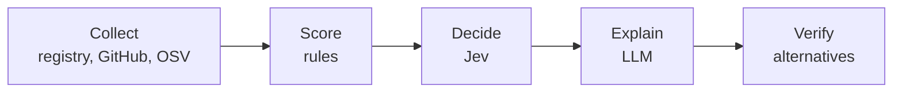

# Package Health

Should you add that library to your project? Give it a package name or paste a dependency file,
and it tells you whether each dependency is **recommended**, worth using with **caution**, or
better **avoided**, with the reasons and alternatives.

For every package it looks at:

- **Adoption**: downloads or dependent packages
- **Maintenance**: release history, last commit, open issues, archived or deprecated status
- **Security**: known vulnerabilities from [OSV.dev](https://osv.dev), including whether your pinned version is affected

It's free and open source. You bring your own API keys, and it works without any (see [Your keys](#your-keys)).

## Supported ecosystems

| Ecosystem | Dependency files |
| --- | --- |
| npm (JavaScript, TypeScript) | `package.json`, `package-lock.json`, `pnpm-lock.yaml` |
| PyPI (Python) | `requirements.txt`, `pyproject.toml`, `Pipfile` |
| Maven (Java, Kotlin) | `pom.xml`, `build.gradle`, `build.gradle.kts` |
| NuGet (C#, .NET) | `*.csproj`, `Directory.Packages.props` |
| Go | `go.mod` |
| crates.io (Rust) | `Cargo.toml` |
| RubyGems (Ruby) | `Gemfile` |
| Packagist (PHP) | `composer.json` |

For a single package you don't have to pick the ecosystem: `@scope/pkg` can only be npm,
`group:artifact` only Maven, and a plain name like `requests` is looked up everywhere and matched
to the registry where it's most used.

## Getting started

You need Python 3.12+ and Node.js 20.19+ or 22.12+.

```bash
# Backend, on http://localhost:8000
cd backend
python3 -m venv .venv
.venv/bin/pip install -r requirements-dev.txt
cp .env.example .env
.venv/bin/uvicorn app.main:app --reload --port 8000
```

```bash
# Frontend, on http://localhost:5173
cd frontend
npm install
npm run dev
```

Keys in `.env` are optional. Without them it still works, with the limits described below.

## Your keys

| Key | Without it | With it |
| --- | --- | --- |
| [GitHub token](https://github.com/settings/personal-access-tokens) | 60 GitHub requests per hour, about 30 packages | 5,000 requests per hour |
| [OpenRouter key](https://openrouter.ai/keys) | Rule-based verdicts and template explanations | Verdicts from [Jev](https://openrouter.ai/docs/guides/community/jev) and written explanations from an LLM, billed to your OpenRouter credits |

A fine-grained GitHub token with read-only access to public repositories is enough.

Put them in `backend/.env` (`GITHUB_TOKEN`, `OPENROUTER_API_KEY`), or send them with each request as
`X-GitHub-Token` and `X-OpenRouter-Key` headers. Header keys are used for that request only and
are never stored or logged. They take priority over `.env`, so a public server can run with an
empty `.env` and every user pays for their own usage.

## API

| Endpoint | Returns |
| --- | --- |
| `POST /api/analyze` | The full report as JSON |
| `POST /api/analyze/stream` | Progress as Server-Sent Events, then the report |
| `GET /api/ecosystems` | Supported ecosystems and their dependency files |

```bash
curl -X POST http://localhost:8000/api/analyze \
  -H "Content-Type: application/json" \
  -H "X-GitHub-Token: github_pat_..." \
  -d '{"mode": "package", "package": "express"}'
```

To analyze a file instead, send `{"mode": "manifest", "content": "<file contents>"}`. The format is
detected from the content, or you can add `"filename": "pom.xml"`. Interactive docs are at
`http://localhost:8000/docs`.

## How it works

The backend is a [LangGraph](https://langchain-ai.github.io/langgraph/) agent behind FastAPI. It
parses the input, then checks every dependency in parallel (up to 8 at once) and merges the
results into one report, sorted worst first.

Each package goes through the same steps:



1. **Collect** data from the package's registry, its GitHub repository and OSV.dev.
2. **Score** it with fixed rules. A deprecated package, an archived repository or a critical
   vulnerability in the latest version always means "avoid".
3. **Decide** the verdict with Jev, a decision model, unless a rule already settled it.
4. **Explain** the verdict and suggest alternatives with an LLM (`z-ai/glm-5.3-flash` by default).
5. **Verify** that the suggested alternatives actually exist in the same registry.

Nothing in that chain is required to succeed. If a data source is down or rate limited, the report
says so and carries on. If Jev or the LLM fails, or there's no OpenRouter key, the rule-based
verdict and template explanations are used. If one package crashes, the others are unaffected.

The frontend is React, TypeScript, Vite, Tailwind CSS and shadcn/ui. It shows each package's
progress as it streams in and keeps recent searches in your browser.

## Configuration

All settings live in `backend/.env`; see [`.env.example`](backend/.env.example).

| Variable | Default | |
| --- | --- | --- |
| `GITHUB_TOKEN` | | See [Your keys](#your-keys) |
| `OPENROUTER_API_KEY` | | See [Your keys](#your-keys) |
| `LLM_MODEL` | `z-ai/glm-5.3-flash` | Any OpenRouter model |
| `USE_JEV_VERDICTS` | `true` | `false` lets the rules decide instead of Jev |
| `MAX_PACKAGES` | `40` | Most dependencies analyzed per file |
| `MAX_CONCURRENCY` | `8` | Packages analyzed in parallel |
| `LOG_FORMAT` | `text` | `json` for log aggregators |
| `LANGSMITH_TRACING` | `false` | Trace runs in [LangSmith](https://smith.langchain.com) (needs `LANGSMITH_API_KEY`) |

## Development

```bash
cd backend
.venv/bin/python -m pytest      # tests
.venv/bin/ruff check app tests  # lint
npx pyright                     # type check, run from the repo root
.venv/bin/langgraph dev         # open the graph in LangGraph Studio
```

```bash
cd frontend
npm run lint
npm run build
```

Every response carries an `X-Request-ID` header. The same ID appears on all of that request's log
lines and in its LangSmith trace, and the UI shows it when something goes wrong.

### Adding an ecosystem

1. Write an adapter in `backend/app/ecosystems/`: subclass `EcosystemAdapter`, or `DepsDevAdapter`
   if [deps.dev](https://deps.dev) covers the ecosystem.
2. Write a parser for each of its dependency files in `backend/app/manifests/` and register it in
   `manifests/registry.py`.
3. Register the adapter in `backend/app/container.py`, and add the ecosystem to
   `backend/app/domain/ecosystems.py` and `frontend/src/lib/ecosystems.ts`.

The scoring, the agent and the UI work with it as is.

## Support

Package Health is free and always will be. If it saved you some time, you can
[buy me a coffee](https://buymeacoffee.com/ipkd3v).

## License

[MIT](LICENSE)
